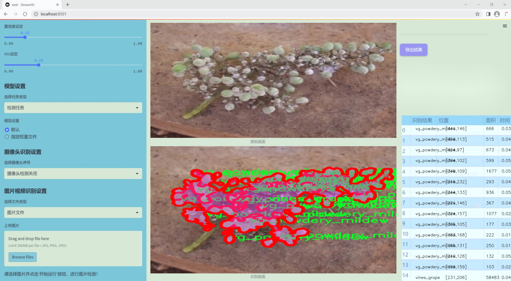
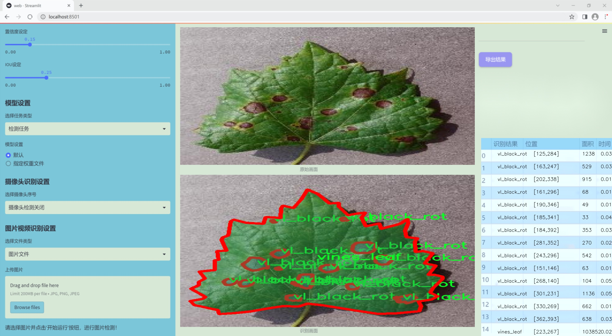
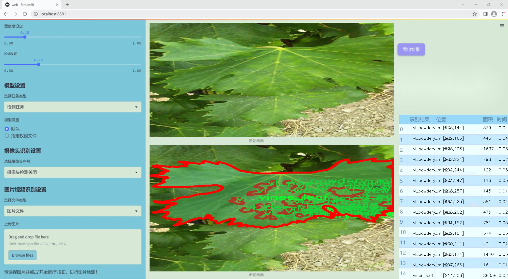
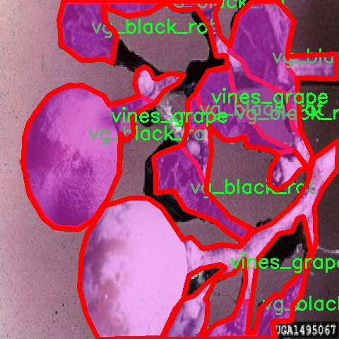
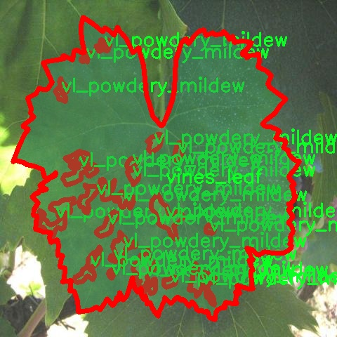
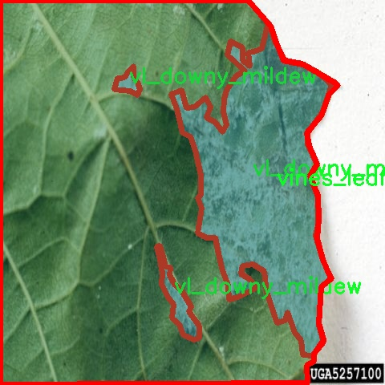
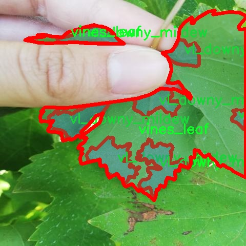

### 1.背景意义

### 研究背景与意义

葡萄种植是全球农业中一项重要的经济活动，尤其在葡萄酒生产和新鲜果品市场中占据了举足轻重的地位。然而，葡萄病害的发生严重影响了产量和果实质量，给农民和相关产业带来了巨大的经济损失。随着气候变化和农业管理实践的不断演变，葡萄病害的种类和传播方式也日益复杂。因此，开发高效、准确的病害检测系统显得尤为重要。

近年来，计算机视觉技术的快速发展为农业病害检测提供了新的解决方案。尤其是基于深度学习的目标检测算法，如YOLO（You Only Look Once），因其高效性和实时性，成为了病害识别领域的研究热点。YOLOv11作为YOLO系列的最新版本，结合了更为先进的特征提取和处理能力，能够在复杂的背景下快速、准确地识别多种病害类型。

本研究旨在基于改进的YOLOv11算法，构建一个针对葡萄病害的检测系统。我们使用的葡萄病害数据集包含16种不同的病害类型，如白腐病、灰霉病和霜霉病等，共计1091张经过标注的图像。这些数据的多样性和丰富性为模型的训练提供了坚实的基础，使其能够在实际应用中具备较强的泛化能力。

通过对葡萄病害的实时监测和识别，农民可以及时采取相应的防治措施，从而降低病害对产量的影响，提升葡萄的整体质量。此外，该系统的开发不仅有助于推动智能农业的发展，也为其他作物的病害检测提供了可借鉴的思路和方法。因此，本研究具有重要的理论价值和实际应用意义，期待为葡萄种植的可持续发展贡献一份力量。

### 2.视频效果

[2.1 视频效果](https://www.bilibili.com/video/BV1gaBvYpECS/)

### 3.图片效果







##### [项目涉及的源码数据来源链接](https://kdocs.cn/l/cszuIiCKVNis)**

注意：本项目提供训练的数据集和训练教程,由于版本持续更新,暂不提供权重文件（best.pt）,请按照6.训练教程进行训练后实现上图演示的效果。

### 4.数据集信息

##### 4.1 本项目数据集类别数＆类别名

nc: 16
names: ['accartocciamento_fogliare', 'carie_bianca_grappolo', 'malattia_esca', 'oidio_tralci', 'red_blotch_foglia', 'vg_black_rot', 'vg_downy_mildew', 'vg_grey_mould', 'vg_powdery_mildew', 'vines_grape', 'vines_leaf', 'virosi_pinot_grigio', 'vl_black_rot', 'vl_downy_mildew', 'vl_grey_mould', 'vl_powdery_mildew']


该项目为【图像分割】数据集，请在【训练教程和Web端加载模型教程（第三步）】这一步的时候按照【图像分割】部分的教程来训练

##### 4.2 本项目数据集信息介绍

本项目数据集信息介绍

本项目旨在改进YOLOv11模型，以实现对葡萄病害的高效检测。为此，我们构建了一个专门针对“Graps Disease”的数据集，该数据集包含16个不同的类别，涵盖了多种常见的葡萄病害。这些类别包括：叶片卷曲病（accartocciamento_fogliare）、白腐病（carie_bianca_grappolo）、木材腐烂病（malattia_esca）、葡萄蔓上的霜霉病（oidio_tralci）、红斑病（red_blotch_foglia）、黑腐病（vg_black_rot）、霜霉病（vg_downy_mildew）、灰霉病（vg_grey_mould）、白粉病（vg_powdery_mildew）、葡萄藤（vines_grape）、葡萄叶（vines_leaf）、灰皮病（virosi_pinot_grigio）、黑腐病（vl_black_rot）、霜霉病（vl_downy_mildew）、灰霉病（vl_grey_mould）以及白粉病（vl_powdery_mildew）。这些类别的选择基于葡萄种植过程中常见的病害类型，旨在为模型提供丰富且多样化的训练样本。

数据集的构建过程包括从多个葡萄种植区域收集图像，确保样本的多样性和代表性。每个类别的图像均经过精心标注，以确保模型能够准确识别不同类型的病害。数据集不仅包含病害的特写图像，还包括不同生长阶段的葡萄植株，以增强模型的泛化能力。通过对这些数据的深入分析和处理，我们期望提高YOLOv11在葡萄病害检测中的准确性和效率，从而为葡萄种植者提供更为有效的病害管理工具。该数据集的建立将为未来的研究和应用奠定坚实的基础，推动葡萄种植领域的智能化发展。










### 5.全套项目环境部署视频教程（零基础手把手教学）

[5.1 所需软件PyCharm和Anaconda安装教程（第一步）](https://www.bilibili.com/video/BV1BoC1YCEKi/?spm_id_from=333.999.0.0&vd_source=bc9aec86d164b67a7004b996143742dc)


[5.2 安装Python虚拟环境创建和依赖库安装视频教程（第二步）](https://www.bilibili.com/video/BV1ZoC1YCEBw?spm_id_from=333.788.videopod.sections&vd_source=bc9aec86d164b67a7004b996143742dc)

### 6.改进YOLOv11训练教程和Web_UI前端加载模型教程（零基础手把手教学）

[6.1 改进YOLOv11训练教程和Web_UI前端加载模型教程（第三步）](https://www.bilibili.com/video/BV1BoC1YCEhR?spm_id_from=333.788.videopod.sections&vd_source=bc9aec86d164b67a7004b996143742dc)


按照上面的训练视频教程链接加载项目提供的数据集，运行train.py即可开始训练



     Epoch   gpu_mem       box       obj       cls    labels  img_size
     1/200     20.8G   0.01576   0.01955  0.007536        22      1280: 100%|██████████| 849/849 [14:42<00:00,  1.04s/it]
               Class     Images     Labels          P          R     mAP@.5 mAP@.5:.95: 100%|██████████| 213/213 [01:14<00:00,  2.87it/s]
                 all       3395      17314      0.994      0.957      0.0957      0.0843

     Epoch   gpu_mem       box       obj       cls    labels  img_size
     2/200     20.8G   0.01578   0.01923  0.007006        22      1280: 100%|██████████| 849/849 [14:44<00:00,  1.04s/it]
               Class     Images     Labels          P          R     mAP@.5 mAP@.5:.95: 100%|██████████| 213/213 [01:12<00:00,  2.95it/s]
                 all       3395      17314      0.996      0.956      0.0957      0.0845

     Epoch   gpu_mem       box       obj       cls    labels  img_size
     3/200     20.8G   0.01561    0.0191  0.006895        27      1280: 100%|██████████| 849/849 [10:56<00:00,  1.29it/s]
               Class     Images     Labels          P          R     mAP@.5 mAP@.5:.95: 100%|███████   | 187/213 [00:52<00:00,  4.04it/s]
                 all       3395      17314      0.996      0.957      0.0957      0.0845


###### [项目数据集下载链接](https://kdocs.cn/l/cszuIiCKVNis)

### 7.原始YOLOv11算法讲解


###### YOLOv11改进方向

与YOLOv 10相比，YOLOv 11有了巨大的改进，包括但不限于：

  * 增强的模型结构：模型具有改进的模型结构，以获取图像处理并形成预测
  * GPU优化：这是现代ML模型的反映，GPU训练ML模型在速度和准确性上都更好。
  * 速度：YOLOv 11模型现在经过增强和GPU优化以用于训练。通过优化，这些模型比它们的前版本快得多。在速度上达到了25%的延迟减少！
  * 更少的参数：更少的参数允许更快的模型，但v11的准确性不受影响
  * 更具适应性：更多支持的任务YOLOv 11支持多种类型的任务、多种类型的对象和多种类型的图像。

###### YOLOv11功能介绍

Glenn Jocher和他的团队制作了一个令人敬畏的YOLOv 11迭代，并且在图像人工智能的各个方面都提供了YOLO。YOLOv 11有多种型号，包括：

  * 对象检测-在训练时检测图像中的对象
  * 图像分割-超越对象检测，分割出图像中的对象
  * 姿态检测-当用点和线训练时绘制一个人的姿势
  * 定向检测（OBB）：类似于对象检测，但包围盒可以旋转
  * 图像分类-在训练时对图像进行分类

使用Ultralytics Library，这些模型还可以进行优化，以：

  * 跟踪-可以跟踪对象的路径
  * 易于导出-库可以以不同的格式和目的导出
  * 多场景-您可以针对不同的对象和图像训练模型

此外，Ultralytics还推出了YOLOv 11的企业模型，该模型将于10月31日发布。这将与开源的YOLOv
11模型并行，但将拥有更大的专有Ultralytics数据集。YOLOv 11是“建立在过去的成功”的其他版本的之上。

###### YOLOv11模型介绍

YOLOv 11附带了边界框模型（无后缀），实例分割（-seg），姿态估计（-pose），定向边界框（-obb）和分类（-cls）。

这些也有不同的尺寸：纳米（n），小（s），中（m），大（l），超大（x）。


YOLOv11模型

###### YOLOv11与前版本对比

与YOLOv10和YOLOv8相比，YOLOv11在Ultralytics的任何帖子中都没有直接提到。所以我会收集所有的数据来比较它们。感谢Ultralytics：

**检测：**


YOLOv11检测统计


YOLOv10检测统计

其中，Nano的mAPval在v11上为39.5，v10上为38.5；Small为47.0 vs 46.3，Medium为51.5 vs
51.1，Large为53.4 vs 53.2，Extra Large为54.7vs
54.4。现在，这可能看起来像是一种增量增加，但小小数的增加可能会对ML模型产生很大影响。总体而言，YOLOv11以0.3
mAPval的优势追平或击败YOLOv10。

现在，我们必须看看速度。在延迟方面，Nano在v11上为1.55 , v10上为1.84，Small为2.46 v2.49，Medium为4.70
v4.74，Large为6.16 v7.28，Extra Large为11.31
v10.70。延迟越低越好。YOLOv11提供了一个非常低的延迟相比，除了特大做得相当差的前身。

总的来说，Nano模型是令人振奋的，速度更快，性能相当。Extra Large在性能上有很好的提升，但它的延迟非常糟糕。

**分割：**


YOLOV11 分割统计


YOLOV9 分割统计


YOLOV8 分割数据

总体而言，YOLOv 11上的分割模型在大型和超大型模型方面比上一代YOLOv 8和YOLOv 9做得更好。

YOLOv 9 Segmentation没有提供任何关于延迟的统计数据。比较YOLOv 11延迟和YOLOv 8延迟，发现YOLOv 11比YOLOv
8快得多。YOLOv 11将大量GPU集成到他们的模型中，因此期望他们的模型甚至比CPU测试的基准更快！

姿态估计：


YOLOV11姿态估计统计


YOLOV8姿态估计统计

YOLOv 11的mAP 50 -95统计量也逐渐优于先前的YOLOv 8（除大型外）。然而，在速度方面，YOLOv
11姿势可以最大限度地减少延迟。其中一些延迟指标是版本的1/4！通过对这些模型进行GPU训练优化，我可以看到指标比显示的要好得多。

**定向边界框：**


YOLOv11 OBB统计


YOLOv8 OBB统计

OBB统计数据在mAP
50上并不是很好，只有非常小的改进，在某种程度上小于检测中的微小改进。然而，从v8到v11的速度减半，这表明YOLOv11在速度上做了很多努力。

**最后，分类：**


YOLOv 11 CLS统计


YOLOv8 CLS统计

从v8到v11，准确性也有了微小的提高。然而，速度大幅上升，CPU速度更快的型号。


### 8.200+种全套改进YOLOV11创新点原理讲解

#### 8.1 200+种全套改进YOLOV11创新点原理讲解大全

由于篇幅限制，每个创新点的具体原理讲解就不全部展开，具体见下列网址中的改进模块对应项目的技术原理博客网址【Blog】（创新点均为模块化搭建，原理适配YOLOv5~YOLOv11等各种版本）

[改进模块技术原理博客【Blog】网址链接](https://gitee.com/qunmasj/good)


#### 8.2 精选部分改进YOLOV11创新点原理讲解

###### 这里节选部分改进创新点展开原理讲解(完整的改进原理见上图和[改进模块技术原理博客链接](https://gitee.com/qunmasj/good)【如果此小节的图加载失败可以通过CSDN或者Github搜索该博客的标题访问原始博客，原始博客图片显示正常】


### D-LKA Attention简介
自2010年代中期以来，卷积神经网络（CNNs）已成为许多计算机视觉应用的首选技术。它们能够从原始数据中自动提取复杂的特征表示，无需手动进行特征工程，这引起了医学图像分析社区的极大兴趣。许多成功的CNN架构，如U-Net、全卷积网络、DeepLab或SegCaps（分割胶囊），已经被开发出来。这些架构在语义分割任务中取得了巨大成功，先前的最新方法已经被超越。

在计算机视觉研究中，不同尺度下的目标识别是一个关键问题。在CNN中，可检测目标的大小与相应网络层的感受野尺寸密切相关。如果一个目标扩展到超出这个感受野的边界，这可能会导致欠分割结果。相反，与目标实际大小相比使用过大的感受野可能会限制识别，因为背景信息可能会对预测产生不必要的影响。

解决这个问题的一个有希望的方法涉及在并行使用具有不同尺寸的多个Kernel，类似于Inception块的机制。然而，由于参数和计算要求的指数增长，将Kernel大小增加以容纳更大的目标在实践中受到限制。因此，出现了各种策略，包括金字塔池化技术和不同尺度的扩张卷积，以捕获多尺度的上下文信息。

另一个直观的概念涉及将多尺度图像金字塔或它们的相关特征表示直接纳入网络架构。然而，这种方法存在挑战，特别是在管理训练和推理时间方面的可行性方面存在挑战。在这个背景下，使用编码器-解码器网络，如U-Net，已被证明是有利的。这样的网络在较浅的层中编码外观和位置，而在更深的层中，通过神经元的更广泛的感受野捕获更高的语义信息和上下文信息。

一些方法将来自不同层的特征组合在一起，或者预测来自不同尺寸的层的特征以使用多尺度的信息。此外，出现了从不同尺度的层中预测特征的方法，有效地实现了跨多个尺度的见解整合。然而，大多数编码器-解码器结构面临一个挑战：它们经常无法在不同尺度之间保持一致的特征，并主要使用最后一个解码器层生成分割结果。

语义分割是一项任务，涉及根据预定义的标签集为图像中的每个像素预测语义类别。这项任务要求提取高级特征同时保留初始的空间分辨率。CNNs非常适合捕获局部细节和低级信息，尽管以忽略全局上下文为代价。视觉Transformer（ViT）架构已经成为解决处理全局信息的视觉任务的关键，包括语义分割，取得了显著的成功。

ViT的基础是注意力机制，它有助于在整个输入序列上聚合信息。这种能力使网络能够合并远程的上下文提示，超越了CNN的有限感受野尺寸。然而，这种策略通常会限制ViT有效建模局部信息的能力。这种局限可能会妨碍它们检测局部纹理的能力，这对于各种诊断和预测任务至关重要。这种缺乏局部表示可以归因于ViT模型处理图像的特定方式。

ViT模型将图像分成一系列Patch，并使用自注意力机制来模拟它们之间的依赖关系。这种方法可能不如CNN模型中的卷积操作对感受野内提取局部特征有效。ViT和CNN模型之间的这种图像处理方法的差异可能解释了CNN模型在局部特征提取方面表现出色的原因。

近年来，已经开发出创新性方法来解决Transformer模型内部局部纹理不足的问题。其中一种方法是通过互补方法将CNN和ViT特征结合起来，以结合它们的优势并减轻局部表示的不足。TransUNet是这种方法的早期示例，它在CNN的瓶颈中集成了Transformer层，以模拟局部和全局依赖关系。HiFormer提出了一种解决方案，将Swin Transformer模块和基于CNN的编码器结合起来，生成两个多尺度特征表示，通过Double-Level Fusion模块集成。UNETR使用基于Transformer的编码器和CNN解码器进行3D医学图像分割。CoTr和TransBTS通过Transformer在低分辨率阶段增强分割性能，将CNN编码器和解码器连接在一起。

增强局部特征表示的另一种策略是重新设计纯Transformer模型内部的自注意力机制。在这方面，Swin-Unet在U形结构中集成了一个具有线性计算复杂性的Swin Transformer块作为多尺度 Backbone 。MISSFormer采用高效Transformer来解决视觉Transformer中的参数问题，通过在输入块上进行不可逆的降采样操作。D-Former引入了一个纯Transformer的管道，具有双重注意模块，以分段的方式捕获细粒度的局部注意和与多元单元的交互。然而，仍然存在一些特定的限制，包括计算效率低下，如TransUNet模型所示，对CNN Backbone 的严重依赖，如HiFormer所观察到的，以及对多尺度信息的忽略。

此外，目前的分割架构通常采用逐层处理3D输入 volumetric 的方法，无意中忽视了相邻切片之间的潜在相关性。这一疏忽限制了对 volumetric 信息的全面利用，因此损害了定位精度和上下文集成。此外，必须认识到，医学领域的病变通常在形状上发生变形。因此，用于医学图像分析的任何学习算法都必须具备捕捉和理解这些变形的能力。与此同时，该算法应保持计算效率，以便处理3D volumetric数据。

为了解决上述提到的挑战，作者提出了一个解决方案，即可变形大卷积核注意力模块（Deformable LKA module），它是作者网络设计的基本构建模块。这个模块明确设计成在有效处理上下文信息的同时保留局部描述符。作者的架构在这两个方面的平衡增强了实现精确语义分割的能力。

值得注意的是，参考该博客引入了一种基于数据的感受野的动态适应，不同于传统卷积操作中的固定滤波器Mask。这种自适应方法使作者能够克服与静态方法相关的固有限制。这种创新方法还扩展到了D-LKA Net架构的2D和3D版本的开发。

在3D模型的情况下，D-LKA机制被量身定制以适应3D环境，从而实现在不同 volumetric 切片之间无缝信息交互。最后，作者的贡献通过其计算效率得到进一步强调。作者通过仅依靠D-LKA概念的设计来实现这一点，在各种分割基准上取得了显著的性能，确立了作者的方法作为一种新的SOTA方法。

在本节中，作者首先概述方法论。首先，作者回顾了由Guo等人引入的大卷积核注意力（Large Kernel Attention，LKA）的概念。然后，作者介绍了作者对可变形LKA模块的创新探索。在此基础上，作者介绍了用于分割任务的2D和3D网络架构。

大卷积核提供了与自注意力机制类似的感受野。可以通过使用深度卷积、深度可扩展卷积和卷积来构建大卷积核，从而减少了参数和计算量。构建输入维度为和通道数的卷积核的深度卷积和深度可扩展卷积的卷积核大小的方程如下：


具有卷积核大小和膨胀率。参数数量和浮点运算（FLOPs）的计算如下：


FLOPs的数量与输入图像的大小成线性增长。参数的数量随通道数和卷积核大小的增加而呈二次增长。然而，由于它们通常都很小，因此它们不是限制因素。

为了最小化对于固定卷积核大小K的参数数量，可以将方程3对于膨胀率的导数设定为零：


例如，当卷积核大小为时，结果是。将这些公式扩展到3D情况是直接的。对于大小为和通道数C的输入，3D情况下参数数量和FLOPs 的方程如下：


具有卷积核大小和膨胀。


利用大卷积核进行医学图像分割的概念通过引入可变形卷积得以扩展。可变形卷积可以通过整数偏移自由调整采样网格以进行自由变形。额外的卷积层从特征图中学习出变形，从而创建一个偏移场。基于特征本身学习变形会导致自适应卷积核。这种灵活的卷积核形状可以提高病变或器官变形的表示，从而增强了目标边界的定义。

负责计算偏移的卷积层遵循其相应卷积层的卷积核大小和膨胀。双线性插值用于计算不在图像网格上的偏移的像素值。如图2所示，D-LKA模块可以表示为：


其中输入特征由表示，。表示为注意力图，其中每个值表示相应特征的相对重要性。运算符  表示逐元素乘法运算。值得注意的是，LKA不同于传统的注意力方法，它不需要额外的规范化函数，如或。这些规范化函数往往忽视高频信息，从而降低了基于自注意力的方法的性能。

在该方法的2D版本中，卷积层被可变形卷积所替代，因为可变形卷积能够改善对具有不规则形状和大小的目标的捕捉能力。这些目标在医学图像数据中常常出现，因此这种增强尤为重要。

然而，将可变形LKA的概念扩展到3D领域会带来一定的挑战。主要的约束来自于需要用于生成偏移的额外卷积层。与2D情况不同，由于输入和输出通道的性质，这一层无法以深度可分的方式执行。在3D环境中，输入通道对应于特征，而输出通道扩展到，其中是卷积核的大小。大卷积核的复杂性导致沿第3D的通道数扩展，导致参数和FLOPs大幅增加。因此，针对3D情况采用了另一种替代方法。在现有的LKA框架中，深度卷积之后引入了一个单独的可变形卷积层。这种战略性的设计调整旨在减轻扩展到3D领域所带来的挑战。


2D网络的架构如图1所示。第一变种使用MaxViT作为编码器组件，用于高效特征提取，而第二变种则结合可变形LKA层进行更精细、卓越的分割。

在更正式的描述中，编码器生成4个分层输出表示。首先，卷积干扰将输入图像的维度减小到。随后，通过4个MaxViT块的4个阶段进行特征提取，每个阶段后跟随降采样层。随着过程进展到解码器，实施了4个阶段的D-LKA层，每个阶段包含2个D-LKA块。然后，应用Patch扩展层以实现分辨率上采样，同时减小通道维度。最后，线性层负责生成最终的输出。

2D D-LKA块的结构包括LayerNorm、可变形LKA和多层感知器（MLP）。积分残差连接确保了有效的特征传播，即使在更深层也是如此。这个安排可以用数学方式表示为：


其中输入特征，层归一化LN，可变形LKA注意力，深度卷积，线性层和GeLU激活函数。

3D网络架构如图1所示，采用编码器-解码器设计进行分层结构化。首先，一个Patch嵌入层将输入图像的维度从（）减小到（）。在编码器中，采用了3个D-LKA阶段的序列，每个阶段包含3个D-LKA块。在每个阶段之后，通过降采样步骤将空间分辨率减半，同时将通道维度加倍。中央瓶颈包括另一组2个D-LKA块。解码器结构与编码器相对称。

为了将特征分辨率加倍，同时减少通道数，使用转置卷积。每个解码器阶段都使用3个D-LKA块来促进远距离特征依赖性。最终的分割输出由一个卷积层产生，后面跟随一个卷积层以匹配特定类别的通道要求。

为了建立输入图像和分割输出之间的直接连接，使用卷积形成了一个跳跃连接。额外的跳跃连接根据简单的加法对来自其他阶段的特征进行融合。最终的分割图是通过和卷积层的组合产生的。

3D D-LKA块包括层归一化，后跟D-LKA注意力，应用了残差连接的部分。随后的部分采用了一个卷积层，后面跟随一个卷积层，两者都伴随着残差连接。这个整个过程可以总结如下：


带有输入特征 、层归一化 、可变形 LKA 、卷积层 和输出特征 的公式。是指一个前馈网络，包括2个卷积层和激活函数。

表7显示了普通卷积和构建卷积的参数数量比较。尽管标准卷积的参数数量在通道数较多时急剧增加，但分解卷积的参数总体较低，并且增长速度不那么快。

与分解卷积相比，可变形分解卷积增加了大量参数，但仍然明显小于标准卷积。可变形卷积的主要参数是由偏移网络创建的。在这里，作者假设可变形深度卷积的Kernel大小为（5,5），可变形深度空洞卷积的Kernel大小为（7,7）。这导致了21×21大小的大Kernel的最佳参数数量。更高效地生成偏移量的方法将大大减少参数数量。


值得注意的是，引入可变形LKA确实会增加模型的参数数量和每秒的浮点运算次数（FLOPS）。然而，重要的是强调，这增加的计算负载不会影响作者模型的整体推理速度。

相反，对于Batch-size > 1，作者甚至观察到推理时间的减少，如图7所示。例如，基于作者的广泛实验，作者观察到对于Batch-size为16，具有可变形卷积和没有可变形卷积的推理时间分别为8.01毫秒和17.38毫秒。作者认为这是由于在2D中对可变形卷积的高效实现所致。为了测量时间，使用了大小为（）的随机输入。在GPU热身周期50次迭代之后，网络被推断了1000次。测量是在NVIDIA RTX 3090 GPU上进行的。


为了充分利用性能与参数之间的权衡关系，作者在图8中可视化了在Synapse 2D数据集上报告的DSC和HD性能以及基于参数数量的内存消耗。D-LKA Net引入了相当多的参数，约为101M。这比性能第二好的方法ScaleFormer使用的111.6M参数要少。

与更轻量级的DAEFormer模型相比，作者实现了更好的性能，这证明了参数增加的合理性。大多数参数来自于MaxViT编码器；因此，将编码器替换为更高效的编码器可以减少模型参数。值得注意的是，在此可视化中，作者最初将HD和内存值都归一化到[0, 100]范围内。随后，作者将它们从100缩小，以增强更高值的表示。


### 9.系统功能展示

图9.1.系统支持检测结果表格显示

  图9.2.系统支持置信度和IOU阈值手动调节

  图9.3.系统支持自定义加载权重文件best.pt(需要你通过步骤5中训练获得)

  图9.4.系统支持摄像头实时识别

  图9.5.系统支持图片识别

  图9.6.系统支持视频识别

  图9.7.系统支持识别结果文件自动保存

  图9.8.系统支持Excel导出检测结果数据


### 10. YOLOv11核心改进源码讲解

#### 10.1 mamba_vss.py

以下是对代码中最核心部分的提取和详细中文注释：

```python
import torch
import torch.nn as nn
import torch.nn.functional as F
from einops import rearrange, repeat
from functools import partial
from typing import Callable

class SS2D(nn.Module):
    def __init__(self, d_model, d_state=16, d_conv=3, expand=2, dropout=0., bias=False, device=None, dtype=None):
        super().__init__()
        # 模型参数初始化
        self.d_model = d_model  # 输入特征维度
        self.d_state = d_state  # 状态维度
        self.d_conv = d_conv  # 卷积核大小
        self.expand = expand  # 扩展因子
        self.d_inner = int(self.expand * self.d_model)  # 内部特征维度
        factory_kwargs = {"device": device, "dtype": dtype}

        # 输入线性变换
        self.in_proj = nn.Linear(self.d_model, self.d_inner * 2, bias=bias, **factory_kwargs)
        
        # 2D卷积层
        self.conv2d = nn.Conv2d(
            in_channels=self.d_inner,
            out_channels=self.d_inner,
            groups=self.d_inner,
            bias=True,
            kernel_size=d_conv,
            padding=(d_conv - 1) // 2,
            **factory_kwargs,
        )
        
        self.act = nn.SiLU()  # 激活函数

        # 状态和时间的线性变换
        self.x_proj_weight = nn.Parameter(torch.empty(4, self.d_inner, self.d_state * 2))  # 权重参数
        self.dt_projs_weight = nn.Parameter(torch.empty(4, self.d_inner, self.d_state))  # 时间投影权重
        self.dt_projs_bias = nn.Parameter(torch.empty(4, self.d_inner))  # 时间投影偏置

        # 初始化A和D参数
        self.A_logs = self.A_log_init(self.d_state, self.d_inner, copies=4, merge=True)
        self.Ds = self.D_init(self.d_inner, copies=4, merge=True)

        self.out_norm = nn.LayerNorm(self.d_inner)  # 输出归一化
        self.out_proj = nn.Linear(self.d_inner, self.d_model, bias=bias, **factory_kwargs)  # 输出线性变换
        self.dropout = nn.Dropout(dropout) if dropout > 0. else None  # dropout层

    def forward(self, x: torch.Tensor):
        # 前向传播
        B, H, W, C = x.shape  # 获取输入的维度
        xz = self.in_proj(x)  # 输入线性变换
        x, z = xz.chunk(2, dim=-1)  # 分割为x和z

        x = x.permute(0, 3, 1, 2).contiguous()  # 调整维度顺序
        x = self.act(self.conv2d(x))  # 经过卷积和激活函数
        y = self.forward_core(x)  # 经过核心前向传播
        y = y * F.silu(z)  # 与z进行逐元素相乘
        out = self.out_proj(y)  # 输出线性变换
        if self.dropout is not None:
            out = self.dropout(out)  # 应用dropout
        return out

    def forward_core(self, x: torch.Tensor):
        # 核心前向传播逻辑
        B, C, H, W = x.shape
        L = H * W  # 计算序列长度
        K = 4  # 固定的K值

        # 处理输入x
        x_hwwh = torch.stack([x.view(B, -1, L), torch.transpose(x, dim0=2, dim1=3).contiguous().view(B, -1, L)], dim=1).view(B, 2, -1, L)
        xs = torch.cat([x_hwwh, torch.flip(x_hwwh, dims=[-1])], dim=1)  # 拼接正向和反向的输入

        # 计算dts, Bs, Cs
        x_dbl = torch.einsum("b k d l, k c d -> b k c l", xs.view(B, K, -1, L), self.x_proj_weight)
        dts, Bs, Cs = torch.split(x_dbl, [self.dt_rank, self.d_state, self.d_state], dim=2)

        # 进一步处理
        dts = torch.einsum("b k r l, k d r -> b k d l", dts.view(B, K, -1, L), self.dt_projs_weight)

        # 进行选择性扫描
        out_y = self.selective_scan(xs, dts, -torch.exp(self.A_logs.float()).view(-1, self.d_state), Bs, Cs, self.Ds.float().view(-1), z=None)
        y = out_y.view(B, K, -1, L)  # 处理输出
        y = self.out_norm(y)  # 归一化
        return y

class VSSBlock(nn.Module):
    def __init__(self, hidden_dim: int = 0, drop_path: float = 0.2, d_state: int = 16, **kwargs):
        super().__init__()
        self.ln_1 = nn.LayerNorm(hidden_dim)  # 归一化层
        self.self_attention = SS2D(d_model=hidden_dim, d_state=d_state, **kwargs)  # 自注意力层
        self.drop_path = nn.Dropout(drop_path)  # dropout层

    def forward(self, input: torch.Tensor):
        input = input.permute((0, 2, 3, 1))  # 调整输入维度
        x = input + self.drop_path(self.self_attention(self.ln_1(input)))  # 残差连接
        return x.permute((0, 3, 1, 2))  # 返回调整后的输出

# 示例代码
if __name__ == '__main__':
    inputs = torch.randn((1, 64, 32, 32)).cuda()  # 随机输入
    model = VSSBlock(64).cuda()  # 创建模型
    pred = model(inputs)  # 前向传播
    print(pred.size())  # 输出预测的尺寸
```

### 代码核心部分解释：
1. **SS2D类**：这是一个自定义的神经网络模块，主要用于处理输入数据的特征提取和状态更新。它包括输入线性变换、卷积层、激活函数、状态和时间的线性变换、以及核心前向传播逻辑。

2. **VSSBlock类**：这是一个包含自注意力机制的模块，使用`SS2D`作为自注意力层，并结合层归一化和残差连接来增强模型的表现。

3. **前向传播逻辑**：在`forward`方法中，输入数据经过线性变换、卷积、激活函数、核心前向传播、归一化和最终的线性变换，输出经过dropout处理的结果。

这些核心部分构成了整个模型的基础，负责输入的处理、特征提取和最终的输出生成。

该文件 `mamba_vss.py` 定义了几个神经网络模块，主要包括 `SS2D`、`VSSBlock` 和 `Mamba2Block`。这些模块是基于 PyTorch 框架构建的，主要用于处理序列数据，尤其是在计算机视觉和时间序列分析中可能会用到。

首先，`SS2D` 类是一个核心模块，继承自 `nn.Module`。它的构造函数接收多个参数，包括模型的维度、状态维度、卷积核大小、扩展因子等。该模块的主要功能是通过线性变换和卷积操作来处理输入数据。构造函数中定义了多个层，包括输入投影层、卷积层、激活函数、输出层等。`dt_init`、`A_log_init` 和 `D_init` 等静态方法用于初始化模型中的参数，确保在训练开始时参数具有合适的值。

`forward_corev0` 方法是 `SS2D` 的前向传播核心，主要实现了数据的选择性扫描。它通过对输入数据进行变换和处理，生成输出结果。这个方法使用了选择性扫描的函数 `selective_scan_fn`，它可以有效地处理序列数据，尤其是在长序列情况下，能够减少计算复杂度。

`forward` 方法则是整个模块的前向传播入口，接收输入数据并经过一系列处理后输出结果。输入数据首先通过线性投影层，然后经过卷积层和激活函数，最后调用 `forward_core` 方法进行核心计算，最后通过输出层得到最终结果。

接下来，`VSSBlock` 类也是一个继承自 `nn.Module` 的模块，主要用于构建自注意力机制。它包含一个归一化层和一个 `SS2D` 自注意力层，以及一个 DropPath 层，用于实现随机丢弃路径的功能。`forward` 方法中，输入数据经过归一化处理后，添加了自注意力层的输出，形成残差连接。

最后，`Mamba2Block` 类继承自 `VSSBlock`，并重写了自注意力层，使用了 `Mamba2Simple` 模块。它的前向传播方法与 `VSSBlock` 类似，但在处理输入时进行了适当的形状调整。

在文件的最后部分，有一个测试代码块，用于验证 `VSSBlock` 和 `Mamba2Block` 的功能。它创建了随机输入数据，并实例化模型进行前向传播，打印输出的形状。

整体来看，该文件实现了一种基于自注意力机制的序列处理模块，适用于需要处理复杂序列数据的深度学习任务。

#### 10.2 hcfnet.py

以下是代码中最核心的部分，并附上详细的中文注释：

```python
import torch
import torch.nn as nn
import torch.nn.functional as F

class SpatialAttentionModule(nn.Module):
    def __init__(self):
        super(SpatialAttentionModule, self).__init__()
        # 定义一个2D卷积层，用于生成空间注意力图
        self.conv2d = nn.Conv2d(in_channels=2, out_channels=1, kernel_size=7, stride=1, padding=3)
        self.sigmoid = nn.Sigmoid()  # 使用Sigmoid激活函数

    def forward(self, x):
        # 计算输入特征图的平均值和最大值
        avgout = torch.mean(x, dim=1, keepdim=True)  # 在通道维度上求平均
        maxout, _ = torch.max(x, dim=1, keepdim=True)  # 在通道维度上求最大值
        # 将平均值和最大值拼接在一起
        out = torch.cat([avgout, maxout], dim=1)
        # 通过卷积层和Sigmoid激活函数生成空间注意力图
        out = self.sigmoid(self.conv2d(out))
        # 将生成的注意力图与输入特征图相乘，得到加权后的特征图
        return out * x

class PPA(nn.Module):
    def __init__(self, in_features, filters) -> None:
        super().__init__()
        # 定义各个卷积层和注意力模块
        self.skip = nn.Conv2d(in_features, filters, kernel_size=1, stride=1)  # 跳跃连接
        self.c1 = nn.Conv2d(filters, filters, kernel_size=3, padding=1)
        self.c2 = nn.Conv2d(filters, filters, kernel_size=3, padding=1)
        self.c3 = nn.Conv2d(filters, filters, kernel_size=3, padding=1)
        self.sa = SpatialAttentionModule()  # 空间注意力模块
        self.drop = nn.Dropout2d(0.1)  # Dropout层
        self.bn1 = nn.BatchNorm2d(filters)  # 批归一化
        self.silu = nn.SiLU()  # SiLU激活函数

    def forward(self, x):
        # 通过跳跃连接获取特征
        x_skip = self.skip(x)
        # 经过多个卷积层
        x1 = self.c1(x)
        x2 = self.c2(x1)
        x3 = self.c3(x2)
        # 将各个特征图相加
        x = x1 + x2 + x3 + x_skip
        # 通过空间注意力模块
        x = self.sa(x)
        # 应用Dropout和批归一化
        x = self.drop(x)
        x = self.bn1(x)
        # 最后通过SiLU激活函数
        x = self.silu(x)
        return x

class DASI(nn.Module):
    def __init__(self, in_features, out_features) -> None:
        super().__init__()
        # 定义各个卷积层和跳跃连接
        self.tail_conv = nn.Conv2d(out_features, out_features, kernel_size=1)
        self.conv = nn.Conv2d(out_features // 2, out_features // 4, kernel_size=1)
        self.bns = nn.BatchNorm2d(out_features)
        self.skips = nn.Conv2d(in_features[1], out_features, kernel_size=1)
        self.skips_2 = nn.Conv2d(in_features[0], out_features, kernel_size=1)
        self.skips_3 = nn.Conv2d(in_features[2], out_features, kernel_size=3, stride=2, dilation=2, padding=2)
        self.silu = nn.SiLU()  # SiLU激活函数

    def forward(self, x_list):
        # 从输入列表中获取不同分辨率的特征图
        x_low, x, x_high = x_list
        # 处理高分辨率特征图
        if x_high is not None:
            x_high = self.skips_3(x_high)
            x_high = torch.chunk(x_high, 4, dim=1)  # 将特征图分成4个部分
        # 处理低分辨率特征图
        if x_low is not None:
            x_low = self.skips_2(x_low)
            x_low = F.interpolate(x_low, size=[x.size(2), x.size(3)], mode='bilinear', align_corners=True)
            x_low = torch.chunk(x_low, 4, dim=1)  # 将特征图分成4个部分
        # 处理当前分辨率特征图
        x = self.skips(x)
        x_skip = x  # 保存跳跃连接的特征图
        x = torch.chunk(x, 4, dim=1)  # 将特征图分成4个部分

        # 结合不同分辨率的特征图
        if x_high is None:
            x0 = self.conv(torch.cat((x[0], x_low[0]), dim=1))
            x1 = self.conv(torch.cat((x[1], x_low[1]), dim=1))
            x2 = self.conv(torch.cat((x[2], x_low[2]), dim=1))
            x3 = self.conv(torch.cat((x[3], x_low[3]), dim=1))
        elif x_low is None:
            x0 = self.conv(torch.cat((x[0], x_high[0]), dim=1))
            x1 = self.conv(torch.cat((x[1], x_high[1]), dim=1))
            x2 = self.conv(torch.cat((x[2], x_high[2]), dim=1))
            x3 = self.conv(torch.cat((x[3], x_high[3]), dim=1))
        else:
            x0 = self.bag(x_low[0], x_high[0], x[0])
            x1 = self.bag(x_low[1], x_high[1], x[1])
            x2 = self.bag(x_low[2], x_high[2], x[2])
            x3 = self.bag(x_low[3], x_high[3], x[3])

        # 将处理后的特征图拼接
        x = torch.cat((x0, x1, x2, x3), dim=1)
        x = self.tail_conv(x)  # 通过尾部卷积层
        x += x_skip  # 加上跳跃连接的特征图
        x = self.bns(x)  # 批归一化
        x = self.silu(x)  # SiLU激活函数

        return x
```

### 代码说明：
1. **SpatialAttentionModule**: 该模块实现了空间注意力机制，通过计算输入特征图的平均值和最大值来生成注意力图，并将其应用于输入特征图，以增强重要特征。
  
2. **PPA**: 该模块是一个包含多个卷积层和空间注意力模块的网络结构。它通过跳跃连接和特征融合来提取和增强特征。

3. **DASI**: 该模块结合了不同分辨率的特征图，通过卷积和跳跃连接来整合信息，最终输出增强后的特征图。

这个程序文件 `hcfnet.py` 定义了一些用于深度学习的神经网络模块，主要包括空间注意力模块、局部全局注意力模块、ECA（Efficient Channel Attention）、PPA（Patch-based Processing Attention）和 DASI（Dual Attention with Skip Information）等。

首先，`SpatialAttentionModule` 类实现了一个空间注意力机制。它通过对输入特征图进行平均池化和最大池化，生成两个特征图，然后将这两个特征图拼接在一起，经过一个卷积层和 Sigmoid 激活函数，得到一个注意力权重图。这个权重图与输入特征图相乘，以突出重要的空间区域。

接下来，`LocalGlobalAttention` 类实现了局部和全局注意力机制。它首先将输入特征图分割成多个小块，并对每个小块进行处理，生成局部特征。然后，通过一个多层感知机（MLP）和层归一化，计算局部特征的注意力权重，并与局部特征相乘。最后，将处理后的特征图恢复到原始大小，并通过一个卷积层输出。

`ECA` 类实现了一种高效的通道注意力机制。它通过自适应平均池化生成特征图的全局信息，然后使用一维卷积来计算通道权重，并通过 Sigmoid 激活函数得到最终的权重。这个权重与输入特征图相乘，以增强重要通道的特征。

`PPA` 类是一个综合模块，结合了卷积、空间注意力和局部全局注意力。它通过多个卷积层处理输入特征，并将跳跃连接的特征与处理后的特征相加，最后通过 ECA 和空间注意力模块进一步增强特征。

`Bag` 类实现了一个简单的加权机制，通过对输入特征进行加权平均，结合了不同来源的特征信息。

最后，`DASI` 类是一个复杂的模块，接收多个输入特征图，并通过跳跃连接和加权机制融合这些特征。它使用多个卷积层处理特征，并在最后通过批归一化和激活函数进行输出。

整体来看，这个文件实现了一些现代深度学习中常用的注意力机制和特征融合策略，旨在提高模型对特征的表达能力和性能。

#### 10.3 SMPConv.py

以下是经过简化并添加详细中文注释的核心代码部分：

```python
import torch
import torch.nn as nn
import torch.nn.functional as F

# 定义一个相对位置的函数，用于生成卷积核的坐标
def rel_pos(kernel_size):
    # 生成从-1到1的线性空间，作为卷积核的坐标
    tensors = [torch.linspace(-1, 1, steps=kernel_size) for _ in range(2)]
    kernel_coord = torch.stack(torch.meshgrid(*tensors), dim=-0)  # 生成网格坐标
    kernel_coord = kernel_coord.unsqueeze(0)  # 增加一个维度
    return kernel_coord

# 定义SMPConv类，继承自nn.Module
class SMPConv(nn.Module):
    def __init__(self, planes, kernel_size, n_points, stride, padding, groups):
        super().__init__()

        self.planes = planes  # 输出通道数
        self.kernel_size = kernel_size  # 卷积核大小
        self.n_points = n_points  # 卷积核中点的数量
        self.init_radius = 2 * (2/kernel_size)  # 初始化半径

        # 生成卷积核坐标
        kernel_coord = rel_pos(kernel_size)
        self.register_buffer('kernel_coord', kernel_coord)  # 注册为缓冲区

        # 初始化权重坐标
        weight_coord = torch.empty(1, n_points, 2)
        nn.init.trunc_normal_(weight_coord, std=0.2, a=-1., b=1.)  # 截断正态分布初始化
        self.weight_coord = nn.Parameter(weight_coord)  # 权重坐标作为可学习参数

        # 初始化半径
        self.radius = nn.Parameter(torch.empty(1, n_points).unsqueeze(-1).unsqueeze(-1))
        self.radius.data.fill_(value=self.init_radius)  # 填充初始半径

        # 初始化权重
        weights = torch.empty(1, planes, n_points)
        nn.init.trunc_normal_(weights, std=.02)  # 截断正态分布初始化
        self.weights = nn.Parameter(weights)  # 权重作为可学习参数

    def forward(self, x):
        # 生成卷积核并进行前向传播
        kernels = self.make_kernels().unsqueeze(1)  # 生成卷积核
        x = x.contiguous()  # 确保输入是连续的
        kernels = kernels.contiguous()  # 确保卷积核是连续的

        # 根据输入数据类型选择不同的卷积实现
        if x.dtype == torch.float32:
            x = _DepthWiseConv2dImplicitGEMMFP32.apply(x, kernels)  # 使用FP32的深度卷积
        elif x.dtype == torch.float16:
            x = _DepthWiseConv2dImplicitGEMMFP16.apply(x, kernels)  # 使用FP16的深度卷积
        else:
            raise TypeError("Only support fp32 and fp16, get {}".format(x.dtype))  # 抛出异常
        return x        

    def make_kernels(self):
        # 计算卷积核
        diff = self.weight_coord.unsqueeze(-2) - self.kernel_coord.reshape(1, 2, -1).transpose(1, 2)  # 计算差值
        diff = diff.transpose(2, 3).reshape(1, self.n_points, 2, self.kernel_size, self.kernel_size)  # 重塑形状
        diff = F.relu(1 - torch.sum(torch.abs(diff), dim=2) / self.radius)  # 计算ReLU激活后的差值
        
        # 计算最终的卷积核
        kernels = torch.matmul(self.weights, diff.reshape(1, self.n_points, -1))  # 计算加权卷积核
        kernels = kernels.reshape(1, self.planes, *self.kernel_coord.shape[2:])  # 重塑形状
        kernels = kernels.squeeze(0)  # 去掉多余的维度
        kernels = torch.flip(kernels.permute(0, 2, 1), dims=(1,))  # 反转卷积核的维度
        return kernels

# 定义SMPCNN类，使用SMPConv进行卷积操作
class SMPCNN(nn.Module):
    def __init__(self, in_channels, out_channels, kernel_size, stride, groups, n_points=None):
        super().__init__()
        padding = kernel_size // 2  # 计算填充
        self.smp = SMPConv(in_channels, kernel_size, n_points, stride, padding, groups)  # 使用SMPConv
        self.small_kernel = 5  # 小卷积核大小
        self.small_conv = nn.Conv2d(in_channels, out_channels, self.small_kernel, stride, self.small_kernel // 2, groups, bias=False)  # 小卷积层

    def forward(self, inputs):
        # 前向传播
        out = self.smp(inputs)  # 通过SMPConv进行卷积
        out += self.small_conv(inputs)  # 加上小卷积的输出
        return out  # 返回最终输出
```

### 代码说明：
1. **`rel_pos` 函数**：生成卷积核的相对位置坐标。
2. **`SMPConv` 类**：自定义的卷积层，使用深度卷积和可学习的卷积核。初始化时设置了权重和半径，并在前向传播中根据输入数据类型选择不同的卷积实现。
3. **`make_kernels` 方法**：计算卷积核的具体实现。
4. **`SMPCNN` 类**：结合了自定义的SMPConv和一个小卷积层的结构，进行特征提取。

该代码的核心部分在于自定义卷积操作的实现，能够根据输入动态生成卷积核，并通过前向传播计算输出。

这个程序文件 `SMPConv.py` 实现了一种新的卷积模块，主要用于深度学习中的卷积神经网络（CNN）。该模块通过自定义的卷积操作来增强特征提取能力，特别是在处理图像数据时。文件中定义了多个类和函数，下面是对代码的详细说明。

首先，导入了必要的库，包括 PyTorch 及其神经网络模块、功能模块和一些自定义模块。特别是，`Conv` 类和 `DropPath` 被引入用于构建卷积层和实现随机丢弃路径的功能。此外，代码尝试导入深度可分离卷积的实现，如果导入失败则会忽略。

`rel_pos` 函数用于生成相对位置的坐标张量，这在后续的卷积操作中会用到。它通过创建一个线性空间来生成坐标，并将其组合成一个网格。

`SMPConv` 类是自定义的卷积层，初始化时接收多个参数，包括输出通道数、卷积核大小、点数、步幅、填充和分组数。在构造函数中，首先计算相对位置的坐标，并初始化权重坐标和半径。权重和半径都被定义为可训练的参数。`forward` 方法中，输入数据通过 `make_kernels` 方法生成卷积核，并根据输入数据的类型选择合适的深度可分离卷积实现。

`make_kernels` 方法用于生成卷积核。它通过计算权重坐标与卷积核坐标之间的差异，并应用 ReLU 激活函数来限制卷积核的值。最后，卷积核通过加权平均的方式生成。

`radius_clip` 方法用于限制半径的值在一定范围内，防止其过小或过大。

接下来，定义了一些辅助函数，如 `get_conv2d` 用于根据条件选择使用自定义的 `SMPConv` 或标准的 `nn.Conv2d`。`get_bn` 和 `conv_bn` 函数用于创建批归一化层和卷积层的组合，`conv_bn_relu` 则在此基础上添加了 ReLU 激活函数。

`SMPCNN` 类实现了一个更复杂的卷积网络结构，它结合了 `SMPConv` 和一个小卷积层，以增强特征提取能力。`forward` 方法将两个卷积层的输出相加，形成最终的输出。

`SMPCNN_ConvFFN` 类实现了一个前馈网络，包含两个逐点卷积层和一个非线性激活函数。它还实现了残差连接，允许信息在网络中更有效地流动。

最后，`SMPBlock` 类是一个模块化的构建块，结合了逐点卷积和大卷积核的特性。它通过两个逐点卷积层和一个大卷积层来处理输入，并使用 ReLU 激活函数和丢弃路径来增强网络的表现。

整体而言，这个文件实现了一种灵活且高效的卷积模块，适用于构建深度学习模型，特别是在处理图像数据时，通过自定义的卷积和激活机制，提升了特征提取的能力。

#### 10.4 ui.py

```python
import sys
import subprocess

def run_script(script_path):
    """
    使用当前 Python 环境运行指定的脚本。

    Args:
        script_path (str): 要运行的脚本路径

    Returns:
        None
    """
    # 获取当前 Python 解释器的路径
    python_path = sys.executable

    # 构建运行命令
    command = f'"{python_path}" -m streamlit run "{script_path}"'

    # 执行命令
    result = subprocess.run(command, shell=True)
    if result.returncode != 0:
        print("脚本运行出错。")


# 实例化并运行应用
if __name__ == "__main__":
    # 指定您的脚本路径
    script_path = "web.py"  # 这里可以直接指定脚本路径

    # 运行脚本
    run_script(script_path)
```

### 代码注释说明：

1. **导入模块**：
   - `import sys`：导入系统相关的模块，用于获取当前 Python 解释器的路径。
   - `import subprocess`：导入子进程模块，用于在 Python 中执行外部命令。

2. **定义函数 `run_script`**：
   - 该函数接受一个参数 `script_path`，表示要运行的 Python 脚本的路径。
   - 函数内部首先获取当前 Python 解释器的路径，存储在 `python_path` 变量中。
   - 然后构建一个命令字符串 `command`，该命令用于通过 `streamlit` 运行指定的脚本。
   - 使用 `subprocess.run` 执行该命令，并将 `shell=True` 作为参数，以便在 shell 中运行命令。
   - 如果命令执行后返回的状态码不为 0，表示执行出错，打印错误信息。

3. **主程序入口**：
   - `if __name__ == "__main__":`：确保只有在直接运行该脚本时才会执行以下代码。
   - 指定要运行的脚本路径 `script_path`，在这里直接指定为 `"web.py"`。
   - 调用 `run_script` 函数，传入脚本路径，执行该脚本。

这个程序文件的主要功能是使用当前的 Python 环境来运行一个指定的脚本，具体来说是一个名为 `web.py` 的脚本。程序首先导入了必要的模块，包括 `sys`、`os` 和 `subprocess`，以及一个自定义的路径处理函数 `abs_path`。

在 `run_script` 函数中，首先获取当前 Python 解释器的路径，这通过 `sys.executable` 实现。接着，构建一个命令字符串，该命令使用 `streamlit` 模块来运行指定的脚本。命令的格式是将 Python 解释器的路径和脚本路径结合起来，形成一个完整的命令行指令。

随后，使用 `subprocess.run` 方法执行这个命令。该方法会在一个新的 shell 中运行命令，并等待其完成。如果脚本运行过程中出现错误，返回的状态码将不为零，程序会打印出“脚本运行出错”的提示信息。

在文件的最后部分，使用 `if __name__ == "__main__":` 来确保只有在直接运行该文件时才会执行后面的代码。在这里，指定了要运行的脚本路径为 `web.py`，并调用 `run_script` 函数来执行它。

总的来说，这个程序的目的是为了方便地在当前 Python 环境中运行一个 Streamlit 应用脚本，并处理可能出现的错误。

### 11.完整训练+Web前端界面+200+种全套创新点源码、数据集获取


# [下载链接：https://mbd.pub/o/bread/Z5iZmpZw](https://mbd.pub/o/bread/Z5iZmpZw)